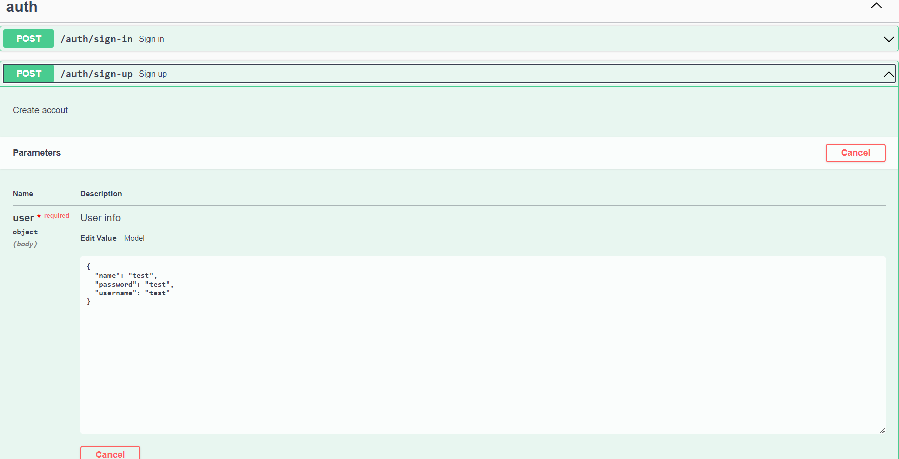
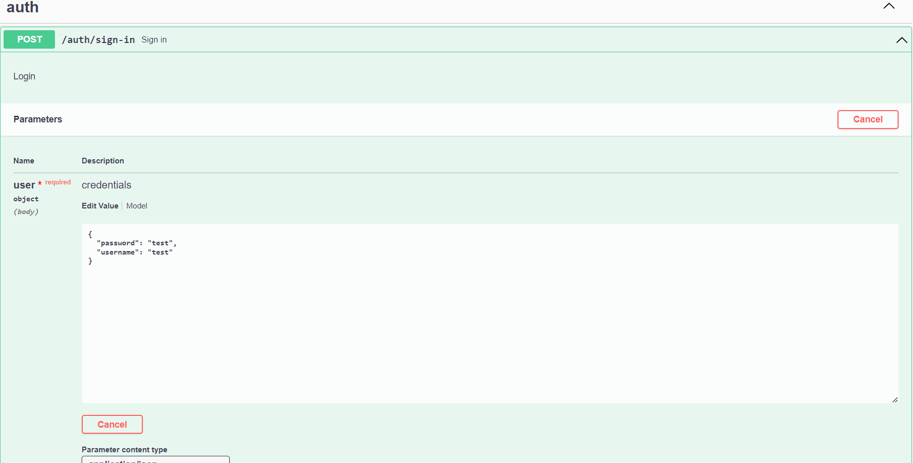
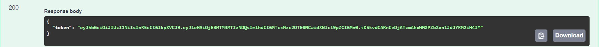
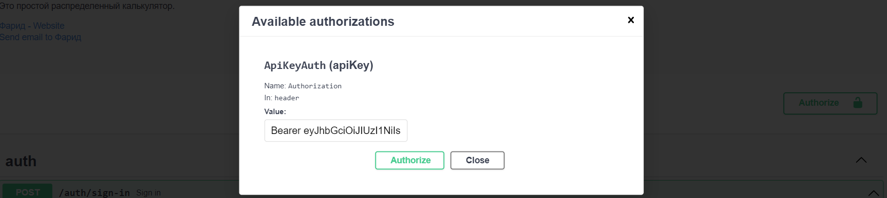
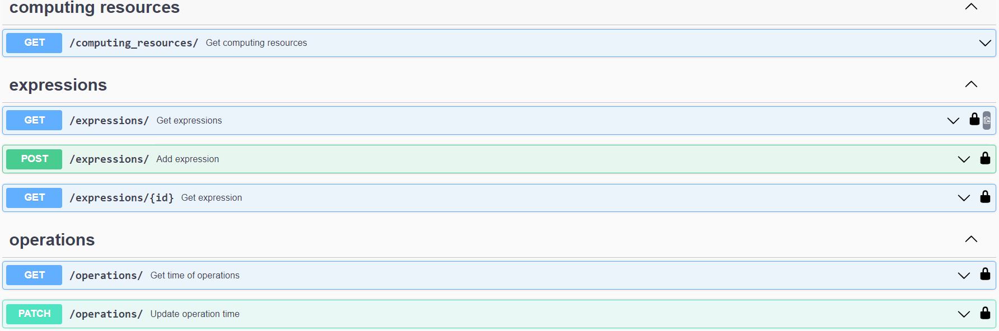

# Distributed calculator
[](https://t.me/M00nfI0wer)


В этом проекте я реализовал распределенный калькулятор с использованием Golang. Идея заключается в том, чтобы отправлять агентам выражения. А те в свою очередь, разбивают их на простейшие математические выражения и направляют на вычислительные центры. Они выполняют математические вычисления и отправляют обратно агенту, который компонует ответ выражения и возвращает результат клиенту. На рисунке ниже показано, как это работает.

## Как его запустить?
#### Оркестратор
Установить PostgreSQL.
Настроить подключение к БД. Редактировать в configs/ файл config.yml.
```sh
port: "8080"

db:
    host: "localhost"
    port: "5432"
    username: "your_username"
    dbname: "your_db_name"
    sslmode: "disable"
```
А также .env файл
```sh
DB_PASSWORD = your_password
```
Запускаем оркестратор
```sh
go run .\cmd\main.go
```
#### Computing agent
Нужно редактировать .env файл. Измените параметр NumOfGoroutine, который отвечает за количество вычислительных центров запущенных на агенте. Также нужно сгенерировать UUID агента для отслеживания оркестратором всех агентов.
```sh
NumOfGoroutine = your_num
UUID = new_uuid
```
Если вы меняли порт запуска оркестратора, необходимо изменить в configs/config.yml адреса для связи с оркестратором.

Далее запускаем агент
```sh
go run .\cmd\main.go
```
## Тестирование
Для данного проекта я задокументировал API с помощью Swagger в swagger.json. А благодаря Swagger UI, которая реализована по end-pointу /swagger/index.html можно тестировать и отпралять различный запросы  оркестратору. 
### Алгоритм тестирования
Сначала необходимо зарегистрировать пользователя

Далее входим в аккаунт

Полученный токен записываем в окно Authorize в следующем формате: "Bearer <your_token>"


После этого уже тестируем работу калькулятора 

Также можно тестировать с помощью Postman по следующим end-pointам


